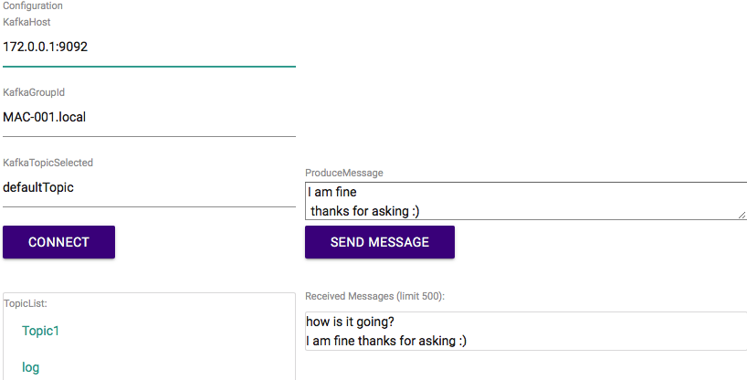

### KAFKA GUI
##### Just a simple application that can send and listen on topics

##### Run
* Open terminal
* go to the folder containing the kafka-gui.jar
* run following command: "java -jar kafka-gui.jar"
* Open browser "localhost:8080"

##### Setup
* you can simply set the spring boot configurations by your own while placing a properties or yml config next to the jar file [see spring boot external config paths](https://docs.spring.io/spring-boot/docs/current/reference/html/boot-features-external-config.html)
* same thing with log configuration

##### Properties (optional)
* kafkagui.default.host <= default ip/hostname with port
* kafkagui.default.groupid <= default groupId
* kafkagui.default.topic  <= default topic
* kafkagui.default.autoconnect <= [true/false] if true it will automatically start with the default connection

##### Known issues
* its just a beta
* not thread safe
* consumer & producer is static and don't belong to the user
* listen on multiple topic and other non default actions causes errors
* dependency problems
* embedded kafka in test causes errors
* errorhandling missing
* timeout at connect
* css issues max-width and rows at receiving messages missing
* JSON formatter receiving messages missing

